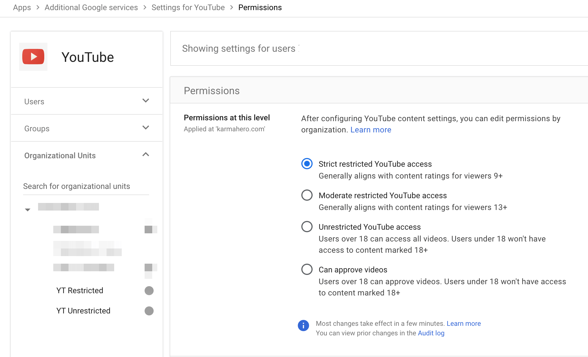
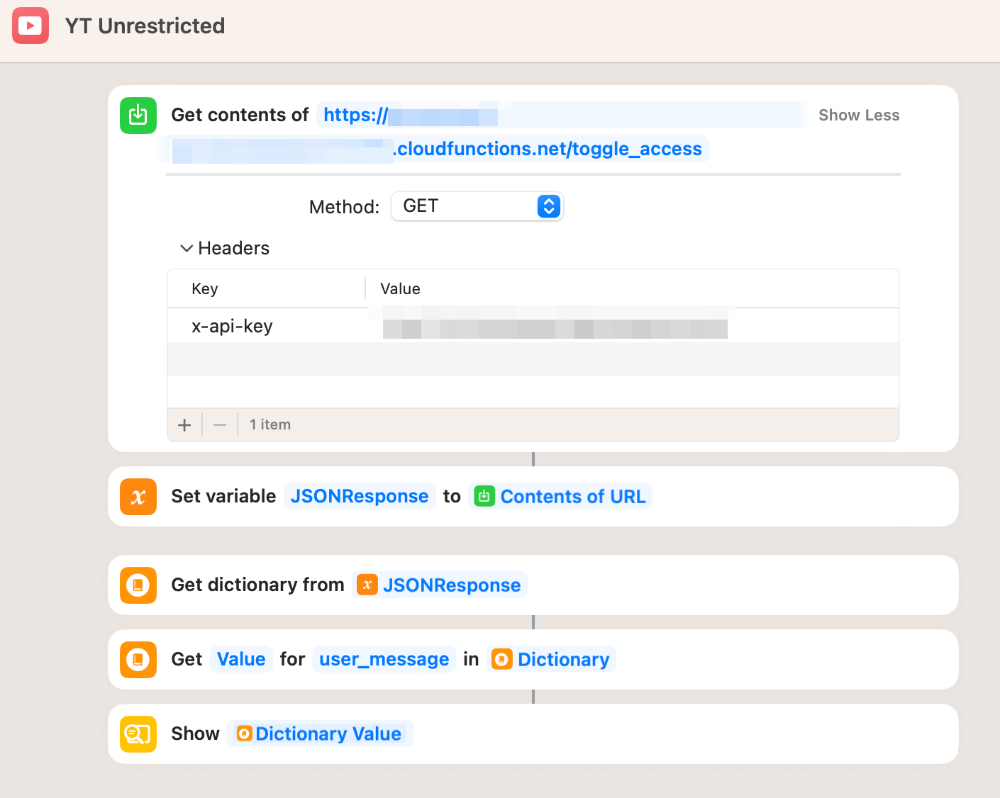

# Google Workspace YouTube Access Control

There's no automated way in Google Workspace to manage these user permissions for YouTube. 



So the workaround is to temporarily assign a different Organizational Unit (OU) to the user needing additional YouTube controls. So in my case I have two OUs named:

1. YT Restricted - with "Strict restricted YouTube access" permission
2. YT Unrestricted - with "Unrestricted YouTube access" permission

All this script does is temporarily assign a different OU to a user and then restore the original OU after a period of time (using Google Cloud Scheduler). So while I use it to manage YouTube permissions, this script does not rely on anything related to YouTube. It's really just an OU toggle-and-restoration script.

## Features

- Temporarily moves a user from a restricted OU to an unrestricted OU.
- Set an expiration time for how long they remain in the unrestricted OU.
- Uses Google Cloud Scheduler to schedule reversion of a user back to the restricted OU after the allotted time.
- Provides a number of times a user is allowed to switch to unrestricted OU each day.

## Dependencies
- Google API client library
- Flask
- croniter

## Environment Variables:

1. Copy the `sample.env` file to `.env`.
2. Update the `.env` file with your actual values.
3. Locally load the environment vairables in your terminal session using:

```bash
set -a
source .env
set +a
```


## Google Cloud Installation

The first step may be to create a service account with domain-wide delegation. But it's been awhile since I set this project up and can't recall, exactly. 

### 1. Set Environment Variables:

Before executing any commands, ensure that you've set the above environment variables in your ``.env`` file. 

### 2. Enable Required APIs:

Activate the necessary Google Cloud APIs:

```bash
#### Enable Google Cloud Storage API
gcloud services enable storage-api.googleapis.com

#### Enable Cloud Scheduler API
gcloud services enable cloudscheduler.googleapis.com
```

### 3. Google Cloud Storage (GCS) Setup:

Create a Google Cloud Storage bucket with the desired configuration:

```bash
#### Create a GCS bucket
gcloud storage buckets create gs://$BUCKET_NAME --location=$LOCATION --default-storage-class=STANDARD
```

### 4. Create and Assign the Custom Role:

First, you'll need to define the custom role and then grant it to the service account:

```bash
#### Create a custom role using the role-definition.yaml
gcloud iam roles create custom_ou_manager --project $PROJECT_ID --file /path/to/role-definition.yaml

#### Assign the custom role to the service account
gcloud projects add-iam-policy-binding $PROJECT_ID --member="serviceAccount:$USER_EMAIL" --role="projects/$PROJECT_ID/roles/custom_ou_manager"
```

Replace `/path/to/role-definition.yaml` with the local path to your `role-definition.yaml` file.

### 5. Google Workspace Admin Setup:

**Manual Steps**:

1. Access the [Google Workspace Admin Console](https://admin.google.com/).
2. Navigate to `Security` > `API controls`.
3. In the `Domain wide delegation` pane, select `Manage Domain Wide Delegation`.
4. Click on `Add new`.
5. Provide the service account's Client ID and the required OAuth scopes for accessing Google Workspace APIs. 

Ensure that you grant the necessary OAuth scopes for the service account to manage users in Google Workspace as used in your script.

## Deploying to Google Cloud Functions

### Pre-requisite:

1. Activate the Google Cloud Functions and Cloud Build APIs:

```bash
gcloud services enable cloudfunctions.googleapis.com
gcloud services enable cloudbuild.googleapis.com
```

### Deploying the Functions:

1. **Deploy `toggle_access` function**:

```bash
gcloud functions deploy toggle_access \
--runtime python39 \
--trigger-http \
--allow-unauthenticated \
--entry-point toggle_access \
--set-env-vars ADMIN_EMAIL="$ADMIN_EMAIL",API_KEY="$API_KEY",USER_EMAIL="$USER_EMAIL",UNRESTRICTED_OU="$UNRESTRICTED_OU",RESTRICTED_OU="$RESTRICTED_OU",PROJECT_ID="$PROJECT_ID",LOCATION="$LOCATION",BUCKET_NAME="$BUCKET_NAME",DURATION_MINUTES="$DURATION_MINUTES"
```

2. **Deploy `cron_revert_ou` function**:

```bash
gcloud functions deploy cron_revert_ou \
--runtime python39 \
--trigger-http \
--allow-unauthenticated \
--entry-point cron_revert_ou \
--set-env-vars ADMIN_EMAIL="$ADMIN_EMAIL",API_KEY="$API_KEY",USER_EMAIL="$USER_EMAIL",UNRESTRICTED_OU="$UNRESTRICTED_OU",RESTRICTED_OU="$RESTRICTED_OU",PROJECT_ID="$PROJECT_ID",LOCATION="$LOCATION",BUCKET_NAME="$BUCKET_NAME",DURATION_MINUTES="$DURATION_MINUTES"
```

After deploying, both functions will be live and accessible via HTTP endpoints provided by Google Cloud Functions. 

## Resetting the Environment
If you need to clean things up and start fresh again here are the instructions. 

### 1. **Delete the `client_requests.json` File from Google Cloud Storage**:

Execute the following command:

```bash
gsutil rm gs://$BUCKET_NAME/client_requests.json
```

### 2. **Delete the Associated Cloud Scheduler Jobs**:

First, sanitize the `USER_EMAIL` environment variable:

```bash
SANITIZED_EMAIL=$(echo $USER_EMAIL | sed 's/@/_/g' | sed 's/\./_/g')
```

Construct the Cloud Scheduler job name:

```bash
JOB_NAME="${SANITIZED_EMAIL}_revert_ou"
```

Then, delete the Cloud Scheduler job using the constructed name:

```bash
gcloud scheduler jobs delete $JOB_NAME
```

### 3. **Manually Restore the User to the Original Restricted OU in Google Workspace**:

1. Visit the [Google Workspace Admin Console](https://admin.google.com/).
2. Sign in using an account with administrative privileges.
3. On the main dashboard, click on the "Users" icon.
4. Locate the user using their email address (from the `USER_EMAIL` environment variable).
5. Click on the user's name to access their profile.
6. On the right side of the profile page, find the "Organizational Unit" section.
7. Click on this section, and a selection pane will appear with a list of OUs.
8. Select the desired restricted OU (use the `RESTRICTED_OU` environment variable as a reference).
9. Save/Apply the changes to update the user's OU.
10. Verify that the user's organizational unit has been updated to the restricted one.

## Testing
You can use curl to interact with the script once it's deployed: 
`curl -X POST \
     -H "x-api-key: $API_KEY" \
     "https://{$LOCATION}-{$PROJECT_ID}.cloudfunctions.net/toggle_access"`

And there are a myriad of gcloud commands for monitoring. Here's a few. 

Of course! Let's integrate your feedback and use the environment variables you provided earlier.

### Monitoring, Analyzing, and Debugging using `gcloud`:

#### 1. **Google Cloud Functions Logs**:
View logs to understand your function's behavior.

- **View logs for a specific function**:

  ```bash
  gcloud functions logs read $FUNCTION_NAME
  ```

Replace `$FUNCTION_NAME` with either `toggle_access` or `cron_revert_ou`, depending on which one you want to monitor.

#### 2. **Google Cloud Storage**:

- **List objects in your bucket**:

  ```bash
  gsutil ls gs://$BUCKET_NAME/
  ```

- **View the content of `client_requests.json`**:

  ```bash
  gsutil cat gs://$BUCKET_NAME/$FILE_NAME
  ```

#### 3. **Google Cloud Scheduler**:

- **List all jobs in a specific location**:

  ```bash
  gcloud scheduler jobs list --location=$LOCATION
  ```

- **Get details about a specific job**:

  ```bash
  gcloud scheduler jobs describe $SANITIZED_EMAIL_revert_ou --location=$LOCATION
  ```

Remember to first sanitize the `USER_EMAIL` to get the `$SANITIZED_EMAIL`:

```bash
SANITIZED_EMAIL=$(echo $USER_EMAIL | sed 's/@/_/g' | sed 's/\./_/g')
```

#### 4. **Google Cloud Functions Configuration**:

- **Describe a Cloud Function to see its configuration and environment variables**:

  ```bash
  gcloud functions describe $FUNCTION_NAME
  ```

#### 5. **General Monitoring and Logging**:

- **View recent activities in your project**:

  ```bash
  gcloud logging read "logName=projects/$PROJECT_ID/logs/cloudaudit.googleapis.com%2Factivity"
  ``` 

## Apple Shortcut
We access this script using the following Apple Shortcut:

